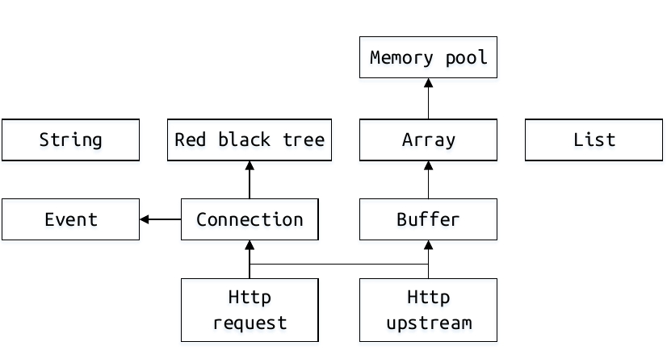

#  fancy: A high performance web server

## 简介

fancy是一个基于事件驱动(epoll)的多进程web服务器. 其原理与Nginx类似，即 **one loop per process**. 除去测试部分代码，fancy代码量约为4000行. fancy的主要特性有：

- epoll+nonblocking IO. epoll是编写高性能服务器的基础设施，Nginx和muduo库都采用了epoll.（*event.c & connection.c*）

- 反向代理HTTP服务器. 简单来说就是转发HTTP request and response.（*upstream.c & http.c*)

- 支持chunked transfer encoding.（*chunk_reader.c*）

- 踢掉空闲连接. fancy使用红黑树实现定时器， 并用于踢掉空闲连接.（*rbtree.c & timer.c*）

- 自适应buffer. TCP连接的读写必须有用户态buffer。fancy参考了muduo库buffer类的设计，实现了一个简易的自适应buffer. 此外，对于长连接，buffer可以重用.（*buffer.c*）

- 协议解析. 使用状态机解析http request和response。在极端情况下，请求会1个字节1个字节地发送。fancy在解析时会记录一个状态变量，这样每次解析都从从先前的状态开始.（*http_parser.c*）

- 使用内存池（*palloc.c*)来简化内存管理.

- 配置文件. fancy 的配置文件风格与Nginx一致.（*config.c*)

  

## 使用

```
cmake .
make
```
