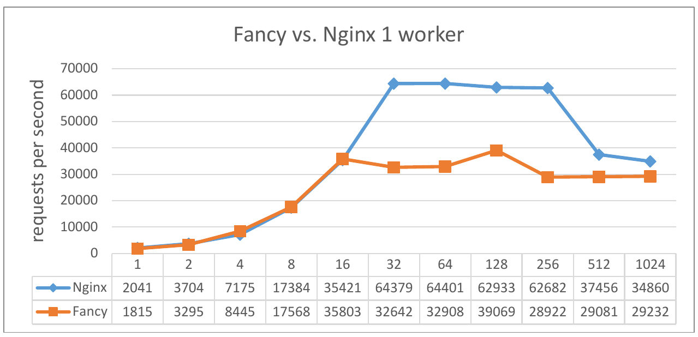
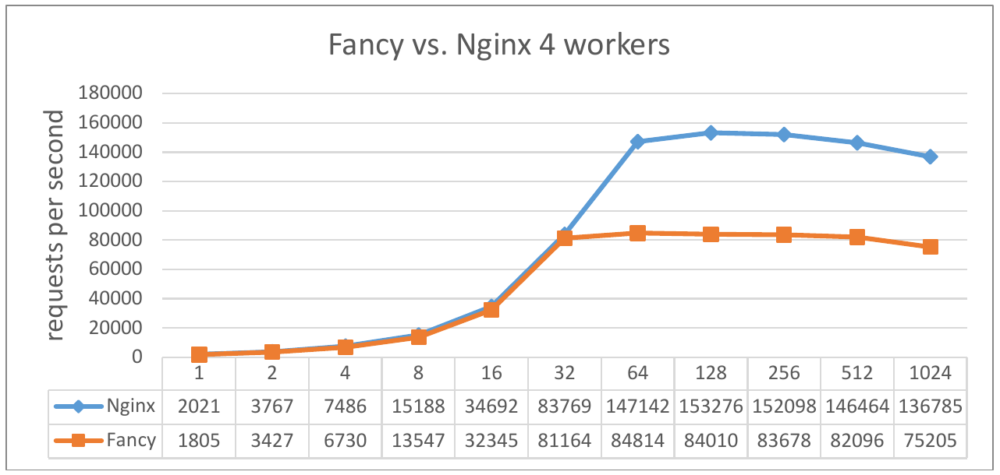

# fancy与Nginx性能比较

fancy支持多进程了！这意味着fancy具有了处理大规模并发请求的**潜力**。然而与“老师傅”Nginx相比，她的性能到底如何呢？本文简单比对了fancy和Nginx在单进程和多进程模式下的性能差距，也算是对开学以来工作的小结。

## 测试环境

- 服务端：运行fancy和Nginx，索尼。。。
- 客户端：运行[ab](https://httpd.apache.org/docs/2.4/programs/ab.html)，惠普（HP）暗影精灵II，8GB内存，CPU i5-6300HQ
- 操作系统：64位 Ubuntu 16.04 LTS
- 网络：千兆以太网

可以看到客户端比服务端的性能要好，这是因为我们要向服务端施压以测试其性能极限，而不是测试客户端。此外，每秒上万次请求很把百兆以太网塞满，因此换用千兆以太网。

## 测试方法

gcc版本为5.4.0，使用`-O2`分别编译fancy和Nginx。我们选用一个仅有20字节的文件作为HTTP请求的传输内容，因为文件太大会受到网络带宽的限制。Nginx的配置如下:

```json
daemon 				off;
master_process 		on;
worker_processes	4;

events {
    worker_connections  10240; 
    accept_mutex        on;
}

http {
    access_log    		off;
  
    sendfile      		on;
    tcp_nopush    		on;
  
    keepalive_timeout  	65;

    server {
        listen       9877;
        server_name  localhost;
        location / {
            root   html;
            index  index.html;
        }
    }
}
```

fancy的配置与Nginx类似。服务端配置完成后，在客户端使用如下命令行发送请求：

`ab -n 100000 -k -c 256 192.168.1.101:9877/test.html`

## 测试结果

首先测试单进程模式下两者的性能。可以看出，在并发连接数小于等于16时，fancy与Nginx的性能相近；当并发连接数到达32，Nginx马上甩开fancy。结论是：**单进程模式下，Nginx的性能是fancy的2倍**。



开启多进程后，fancy的表现又如何呢？可以看出，当并发连接数小于等于32时，两者的性能相当；然而当并发连接数到达32，Nginx又远超fancy。结论是：**四进程条件下，Nginx的性能是fancy的1.9倍**。



## 结论

尽管fancy参考了Nginx的代码，但是在性能方面仍然远不及Nginx。事实上，Nginx做了许多细节上的优化，例如通过缓存时间变量来避免`gettimeofday`系统调用；通过设置查找表的大小和内存位置来让它恰好能放进一个cache line；通过将短函数写成宏来避免函数调用的开销等等。这些优化fancy都没有刻意去做，而是将主要精力放在了事件驱动本身。当然，并不是说fancy做到这些就能匹敌Nginx。作为一个初级码农，肯定还有许多地方等着我去探索吧:-)

贴一张演员合照

