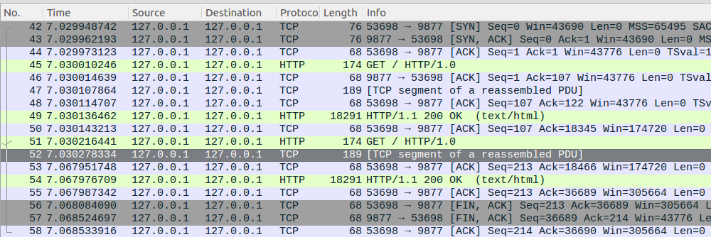
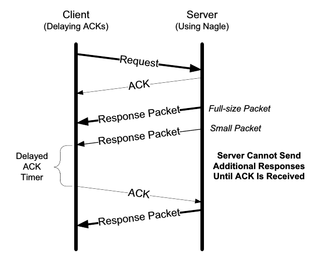
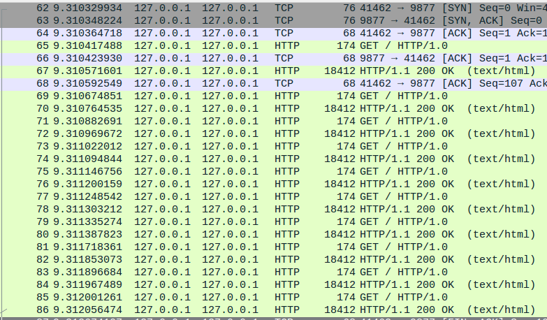
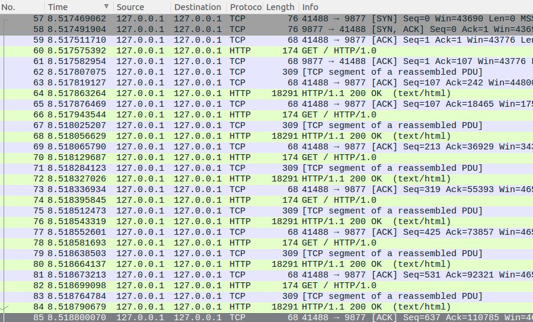

# TCP的Nagle算法与Delay ACK 

## Fancy的性能问题

我使用Apache的工具`ab`来测试**本机通信**，**单进程**条件下Fancy的静态页面访问性能：

`ab -n 1000 -k -c 1 localhost:9877/`

`ab`会先建立一个tcp连接，然后向server发送1000个HTTP请求，最后关闭连接。在我的机器上，Nginx的测试结果大约为30000 requests per second；然而Fancy的测试结果却低到离谱，只有25 requests per second. Fancy与Nginx都采用epoll结合非阻塞IO的设计，两者性能相差两个数量级，只能说明Fancy犯了低级错误。

## 原因

在测试中发现Fancy的CPU占用率仅为1%，而Nginx则维持在80%以上，这说明Fancy应该阻塞在了某个调用，导致CPU的使用率极低。然而Fancy所有的IO操作都是非阻塞的，又怎会阻塞在某个调用？答案是`epoll_wait(2)`和`open(2)`两个系统调用，两者都会阻塞。前者用于驱动整个事件循环，后者用于打开将要发送的静态文件。通过在调用前后打时间戳排除掉了`open(2)`，那么真正阻塞的地方就是`epoll_wait(2)`。时间戳显示每次调用都恰好阻塞40ms，这与25 request per second的测试结果吻合。

现在的问题是，为何`epoll_wait(2)`调用会阻塞？有两种可能的情况：1. 没有IO事件发生。当client没有发送请求时，server当然会阻塞在`epoll_wait(2)`。2. 有IO事件发生，但由于epoll的边沿触发机制导致一个IO事件只被通知一次。此时，即使缓冲区有数据，`epoll_wait(2)`仍然会阻塞。为了验证以上可能，使用wireshark抓包分析。用`ab`发送两个请求:

`ab -n 2 -k -c 1 localhost:9877/`

注意看No.52和No.53报文，前者是server发送的response头部，后者是client的ACK，两者的时间戳相差37ms！与`epoll_wait(2)`的阻塞时间如此相近，几乎已经说明了阻塞的原因是前一段中说的情况1，即没有IO事件发生。让我们继续探索“没有IO事件发生”的真实原因。

观察抓包结果发现两个问题：1. server为何不将response body紧接着response header发送出去，而是要等client ACK以后再发？2.client为何不在收到response header以后马上ACK而是要等待40ms？这属于TCP协议实现的内容，事实上，W.Richard Stevens在其经典著作《TCP/IP详解 卷1》的第15.4.1节中早已阐明了问题所在：

> ***Delayed ACK and Nagle Algorithm Interaction***
>
> 
>
> ...Here we see that the client, after receiving two packets from the server, withholds an ACK, hoping that additional data headed toward the server can be piggybacked...At the server side, because the Nagle algorithm is operating, no additional packets are permitted to be sent to the client until an ACK is returned because at most one “small” packet is allowed to be outstanding. **The combination of delayed ACKs and the Nagle algorithm leads to a form of *deadlock*** (each side waiting for the other).

总地来说：TCP协议的Nagle算法和Delay ACK机制的交互作用使得server和client死锁。这样就可以回答前文提出的两个问题：

- 问：server为何不将response body紧接着response header发送出去，而是要等client ACK以后再发？
- 答：因为Nagle算法的限制。在接收到前一个报文的ACK以前，新的报文是不会发送出去的。直到收到ACK，server才会将积累的数据放在一个报文里发出去。这样设计的好处很明显：TCP/IP头部会占用一些字节，发送多个小报文(tinygrams)会增大overhead，合并为一次发送更高效。
- 问：client为何不在收到response header以后马上ACK而是要等待40ms？
- 答：因为Delay ACK机制。这样设计的好处也很明显：一方面，server可能还有更多的报文将要发送；另一方面，client可能会想要发送数据。通过延迟一段时间，然后在client的发送的数据里一次ACK多个报文，即捎带确认(piggyback)，减小了overhead。

当两者相互作用的时候就会**死锁**：server在等待client的ACK然后将多个报文合成一个发送；而client在等待server的数据以方便捎带确认。当然，由于Delay ACK的时间限制，client终究会发出ACK，死锁解除。这个时间应该就是`epoll_wait(2)`的阻塞时间**40ms**.

## 解决

如何在server端解决这个问题？直接的方法是关闭TCP的Nagle算法（`TCP_NODELAY`），这样只要server的缓冲区有数据就会立刻发送。这样做的坏处是每次response至少会发送两个TCP报文：header和body。更好的办法是使用`TCP_CORK`选项：先告知内核不要发送任何数据，等整个response写入缓冲区后，再通知TCP发送数据。这样一个response就会尽量放到一个TCP报文里。我们用wireshark验证一下：

可以看到，除去第一个HTTP请求，剩下的请求/回复过程都非常流畅，没有多余的TCP报文。再来看看Nginx的TCP通信过程：

可以看出Nginx将response header和response body分成两个TCP报文发送。解决了上述问题以后，我们回到本文开始的地方，Fancy的性能几何？

`ab -n 1000000 -k -c 1 localhost:9877/`

- Fancy: 35465 requets per second
- Nginx: 37232 requests per second

完。